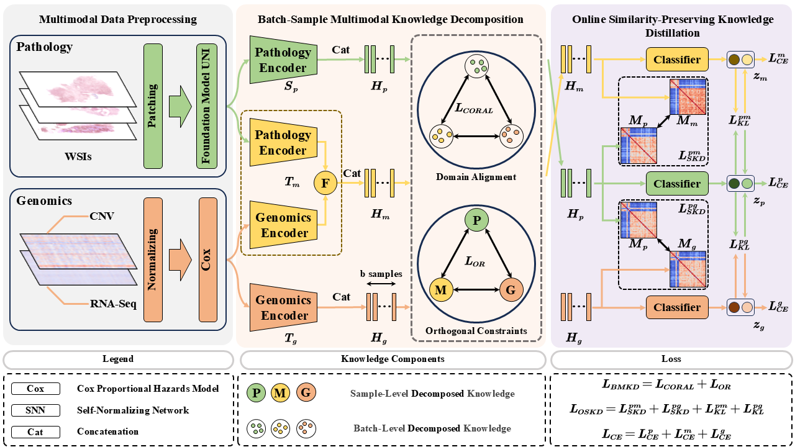

# GMKDN: Multi-modal Knowledge Decomposition based Online Distillation for Biomarker Prediction in Breast Cancer Histopathology

This repository contains the official PyTorch implementation of the paper "Online Teaching: Distilling Decomposed Multimodal Knowledge for Breast Cancer Biomarker Prediction".

## Overview

GMKDN (Genomics-guided Multi-modal Knowledge Decomposition Network) is a novel deep learning framework that addresses the critical challenge of **missing modality** in biomarker prediction for breast cancer histopathology. Traditional immunohistochemical (IHC) biomarker determination (ER, PR, HER2) is time-consuming and costly, while existing multi-modal approaches struggle with the simultaneous acquisition of genomic and pathological data due to technical and financial constraints.

Our approach introduces **Multi-modal Knowledge Decomposition (MKD)** with online distillation, enabling robust biomarker prediction from H&E-stained histopathology images alone. The framework decomposes knowledge into **modality-specific** and **modality-general** components through a dual-teacher, single-student architecture:

## Framework Architecture

<p align="center">
  
</p>

The framework consists of:
- **Multimodal Data Preprocessing**: Processes histopathology images, mRNA expression, and CNV data
- **Batch-Sample Multimodal Knowledge Decomposition**: Decomposes knowledge into three orthogonal  components
- **Online Similarity-Preserving Knowledge Distillation**: Capture the relative relationships between samples


```
# train with 5-fold cross validation and test
./run.sh
=======
## Requirements

### Environment
- Python 3.9+
- PyTorch 2.0.1+

### Dependencies

Create the conda environment using the provided environment.yaml file:

```bash
# Create environment from yaml file
conda env create -f environment.yaml

# Activate the environment
conda activate cu118
```

## Dataset Preparation

### Data Structure
```
project_root/
├── pt_files/               # Histopathology image features (1024-dim, extracted via CLAM)
│   └── [case_id].pt       # Each .pt file contains WSI features for a patient case
├── data_mrna.csv          # mRNA expression data (genes × patients)
├── data_cnv.csv           # CNV (Copy Number Variation) data (genes × patients)
├── cox_mrna.csv           # p-values for mRNA feature selection
├── cox_cnv.csv            # p-values for CNV feature selection
└── splits/
    └── 5foldcv/
        ├── ER/             # ER biomarker splits
        │   └── splits_[0-4].csv  # 5-fold cross-validation splits
        ├── PR/             # PR biomarker splits
        └── HER2/           # HER2 biomarker splits
```

### Data Format Details
- **WSI Features**: PyTorch tensor files (`.pt`) containing 1024-dimensional UNI features extracted from histopathology images (slides are first patchified using CLAM, then UNI extracts features from patches)
- **mRNA Data**: CSV file (`cox_mrna.csv`) with genes as columns and patient case IDs as rows
- **CNV Data**: CSV file (`cox_cnv.csv`) with genes as columns and patient case IDs as rows
- **p-values**: Separate CSV files (`cox_mrna.csv`, `cox_cnv.csv`) containing statistical significance values from Cox regression analysis, used for selecting top-k genomic features
- **Splits**: CSV files defining train/validation/test splits for cross-validation

## Quick Start

### Training
```bash
# Train with 5-fold cross validation
./run.sh
```

### Custom Training
```bash
# Single biomarker training (ER)
python train_kd.py --split_dir "ER" --data_root_dir "./pt_files" --path_mrna "data_mrna.csv" --path_cnv "data_cnv.csv" --pvalues_path_mrna "cox_mrna.csv" --pvalues_path_cnv "cox_cnv.csv" --lr 0.0002 --gc 32 --temp 4 --stage "train" --max_epochs 100 --seed 1 --weighted_sample --early_stopping

# Testing
python train_kd.py --split_dir "ER" --data_root_dir "./pt_files" --path_mrna "data_mrna.csv" --path_cnv "data_cnv.csv" --pvalues_path_mrna "cox_mrna.csv" --pvalues_path_cnv "cox_cnv.csv" --lr 0.0002 --gc 32 --temp 4 --stage "test" --max_epochs 100 --seed 1 --weighted_sample --early_stopping
```


## Configuration

### Key Parameters
```python
# Data Paths
--data_root_dir: Directory containing WSI feature files (.pt files)
--path_mrna: Path to mRNA expression data CSV file
--path_cnv: Path to CNV data CSV file
--pvalues_path_mrna: Path to mRNA p-values CSV for feature selection
--pvalues_path_cnv: Path to CNV p-values CSV for feature selection

# Training Parameters
--lr: Learning rate (default: 0.0002)
--temp: Temperature for knowledge distillation (default: 4)
--max_epochs: Maximum training epochs (default: 100)
--batch_size: Batch size (default: 1)
--drop_out: Dropout rate (default: 0.25)
--topk: Top-k genomic features to select (default: 8192)
--fusion: Fusion method ['concat', 'bilinear'] (default: 'bilinear')
--gc: Gradient accumulation steps (default: 32)
```

### Knowledge Decomposition And Distillation Options
```python
--intermediate_loss_fn: Intermediate layer loss ['SP', 'NOT'] (default: 'SP')
--logits_loss_fn: Logits layer loss ['KL', 'NOT'] (default: 'KL')
--OR: Orthogonal decomposition ['OR', 'NOR'] (default: 'OR')
--DA: Domain alignment ['DA', 'NDA'] (default: 'DA')
```

## Results

### Performance Metrics
The model outputs comprehensive evaluation metrics:
- **AUC**: Area Under the ROC Curve
- **AP**: Area Under Precision-Recall Curve
- **Accuracy**: Classification accuracy
- **Precision/Recall**: Per-class metrics

### Output Files
- `val.csv`: Validation results across folds
- `test.json`: Test set performance metrics
- `output_path_metrics.csv`: Pathology-specific metrics
- `output_omic_metrics.csv`: Genomic-specific metrics  
- `output_mul_metrics.csv`: Multi-modal fusion metrics

## Project Structure

```
GMKDN/
├── models/                 # Model architectures
│   ├── online_kd.py       # GMKDN main model
│   ├── abmil.py           # ABMIL
│   ├── clam.py            # CLAM 
│   ├── transmil.py        # TransMIL
│   └── ...
├── trainer/               # Training scripts
│   ├── online_kd_trainer.py
│   ├── mil_trainer.py
│   └── ...
├── utils/                 # Utility functions
│   ├── loss/              # Knowledge distillation losses
│   ├── dataset/           # Dataset loaders
│   └── ...
├── dataset/               # Dataset processing
├── train_kd.py           # Main training script
├── run.sh                # Batch training script
└── create_fold.py        # Cross-validation splits
```

## Citation

If you find our work useful in your research, please cite:

```bibtex
@article{zhangonline,
  title={Online Teaching: Distilling Decomposed Multimodal Knowledge for Breast Cancer Biomarker Prediction},
  author={Zhang, Qibin and Hao, Xinyu and Wang, Tong and Zhu, Yanmei and Du, Yaqi and Gao, Peng and Cong, Fengyu and Lu, Cheng and Xu, Hongming},
  journal={IEEE transactions on medical imaging}
}
```

## Contact

For questions or issues, please open an issue on GitHub or contact the authors.

## Acknowledgments

- CLAM framework for tissue slide patchification and UNI for feature extraction

